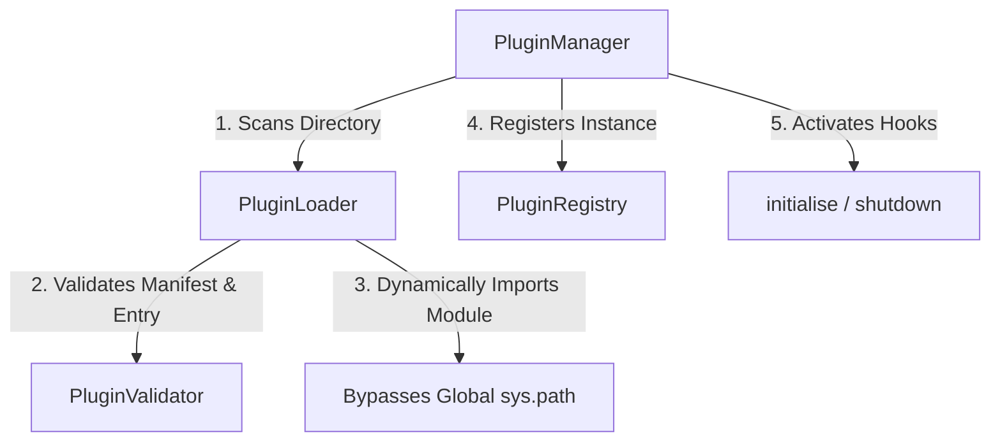

# GoblinOS Plugin System

The Plugin System enables optional functionality to be dynamically discovered, loaded, and managed by GoblinOS at runtime without altering core application layers.

---

## 1. Directory Structure

Plugins are stored in individual subdirectories under the `plugins/` directory:

```text
plugins/
    example_plugin/
        manifest.json
        plugin.py
        README.md
```

### Manifest Schema (`manifest.json`)
The manifest configures the metadata and entry point of a plugin. It must contain:
- `name` (string): Unique identifier for the plugin.
- `version` (string): Semantic version.
- `author` (string): Author name.
- `description` (string): Short functional description.
- `entry` (string): Path to the python file containing the subclass of `BasePlugin` relative to the plugin folder.

Example:
```json
{
  "name": "example-plugin",
  "version": "1.0.0",
  "author": "James",
  "description": "A demo plugin.",
  "entry": "plugin.py"
}
```

---

## 2. Architecture & Lifecycle

The plugin lifecycles are coordinated by the `PluginManager` which delegates to the `PluginLoader` and registers instances in the `PluginRegistry`.



### Lifecycle States
1. **Discovered**: Directory and manifest are verified as valid.
2. **Loaded**: Python module is loaded and plugin class is instantiated.
3. **Enabled**: The `initialise()` method is executed.
4. **Disabled / Shutdown**: The `shutdown()` method is executed.

---

## 3. Creating a New Plugin

To create a new plugin:

1. Create a subfolder under `plugins/` e.g., `plugins/my_plugin`.
2. Add a `manifest.json` setting `entry` to your main python script (e.g. `plugin.py`).
3. Implement a subclass of `BasePlugin` inside the script:

```python
from plugins.base_plugin import BasePlugin

class MyPlugin(BasePlugin):
    def initialise(self) -> None:
        # Code run when the plugin is enabled
        print("MyPlugin initialized!")

    def shutdown(self) -> None:
        # Code run when the plugin is disabled or application closes
        print("MyPlugin shut down!")
```

---

## 4. Extension Points

Plugins can register classes with the core using extension points exposed on the `PluginManager`:
- `register_worker(worker_class)`: Register custom worker subclasses.
- `register_tool(tool_class)`: Register custom tool subclasses.
- `register_service(service_class)`: Register custom application services.

---

## 5. Troubleshooting

- **Duplicate registration**: Ensure no two plugins share the same `name` property inside their `manifest.json`.
- **Missing entrypoint error**: Confirm the `entry` file specified exists relative to the plugin folder.
- **Import errors**: Ensure all external imports within the plugin entry module are installed in the Python environment.
- **Failure Resilience**: If a plugin fails during `initialise()`, it will be automatically disabled and unloaded, allowing other plugins to load unaffected. Check the `logs/caller_os.log` for logs prefixed with `PluginManager` or `PluginLoader`.

---

## 6. Plugin Trust Model

In GoblinOS Version 1, **all plugins are treated as trusted code**. 
- Because plugins are loaded dynamically using Python's `importlib` and run in the same process context as the host system, they have the ability to execute arbitrary Python operations, read/write local files, and run system tasks.
- No plugin sandboxing, certificate verification, or cryptographic signing is performed in Version 1. 
- Ensure that only plugins from trusted authors or vetted internal sources are placed within the approved `plugins/` root directory.

